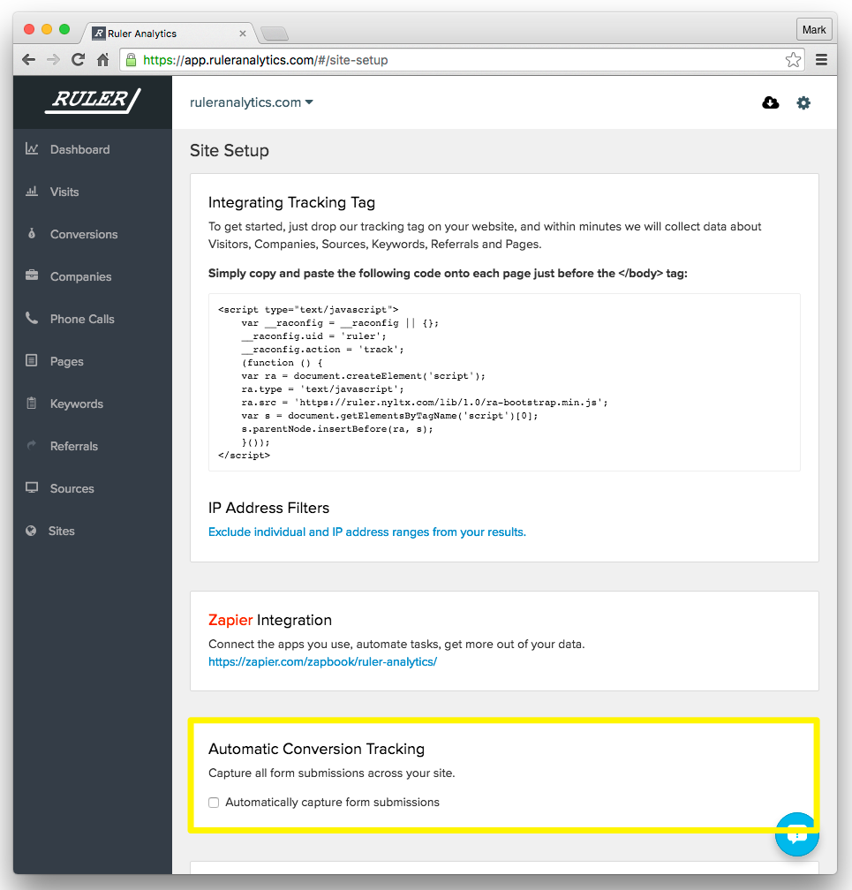

===========================================
Conversion Tracking
===========================================

.. Important::
    This is a work in progress... don't follow any instructions yet.

Automatically capturing form submissions
===========================================

To automatically capture all standard HTML form posts choose requires a single click from the site settings page within the Ruler Dashboard https://app.ruleranalytics.com/#/site_settings

Manually capturing your data
===========================================

If you want more control over what data is captured in Ruler Analytics you can manually capture your data using one of the following methods.

HTML forms with POST action
-----------------------------

For standard (old school) HTML forms add a conversion javascript tag to your ``checkout`` or ``thank you`` page

.. code-block:: html
    :linenos:

    

this needs to appear above the :doc:`tracking javascript tag <getting_started#javascript-tracking-tag>` tag. The ``<head>`` tag is a good place to start.

Wordpress Capture Form 7
---------------------------

This plugin for wordpress submits the forms via ``ajax``. To capture data from the form we need to configure the *****
post settings.

.. code-block:: javascript

    on_sent_ok: 'var email=RulerAnalytics.__sz("input[name=your-email]")[0].value;RulerAnalytics.RegisterAction({ uid: "56d04f7c8c0d4", action:"convert", email:email});’

Or from version 1.1 of ruler analytics

.. code-block:: javascript

    RulerAnalytics.trackForm('input', 'formselector', 'goalname')

What do we mean by a standard HTML form?
===========================================

*How technical do you want to go? Let's keep it simple!*

A traditional HTML form will 'post' its data to the webserver
which will process the results and then serve up another page. Usually a ``thank-you`` or ``checkout-complete`` type page.
